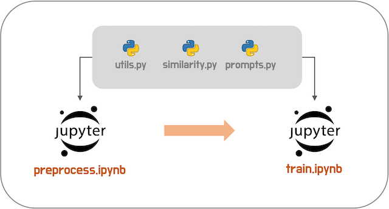
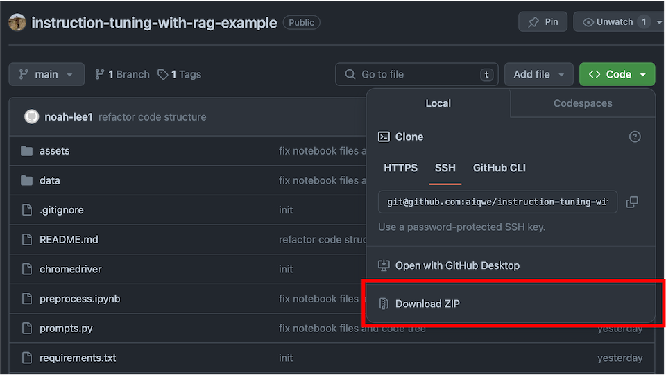
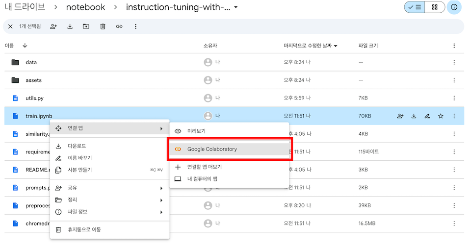

# 어떤 코드인가요?
생성형 LLM을 학습하거나 개발할 때 외국어로된 Instruction Tuning 예제는 많았지만, 한글로된 예제는 찾기가 어렵습니다.  
특히나 End-to-end 예제는 영문으로된 예제도 찾기 어려웠던 것 같습니다.
(대부분 train.py만 만들어 놓고 데이터는 이미 가공된 데이터를 사용한 예제를 보여줬네요.)  
이 예제는 [Stanford Alpaca](https://github.com/tatsu-lab/stanford_alpaca)를 기반으로, 각종 참조 자료를 바탕으로 작성한 Instruction Tuning의 예제 코드입니다.  

ChatGPT를 활용하여 혼자서도 데이터 셋을 만들어볼 수 있으며, LoRA를 이용하여 작은 GPU에서도 학습을 실험해볼 수 있습니다.

<br>
<br>

# 목차
[개요](#개요)  
[훈련 스펙](#훈련-스펙)  
[코드 트리](#코드-트리)  
[참조 문서](#참조-문서)  
[Colab 실행 가이드](#Colab-실행-가이드)  

<br>
<br>

# 개요
본 예제는  
1. [부동산에 관련된 학습 데이터셋](data/instruction.jsonl)을 만들어보고
2. [Gemma모델](https://huggingface.co/google/gemma-2b-it)에 학습시켜
직접 생성형 모델을 만들어보는 것이 목적입니다.

  

[preprocess.ipynb](preprocess.ipynb)  
데이터를 전처리하는 과정을 담았습니다. 좋은 데이터셋을 만들기 위해 Claude Web 버젼과 GPT4 API를 사용하였습니다.
  
[train.ipynb](train.ipynb)  
훈련 데이터셋을 PEFT로 학습시켜 모델을 튜닝합니다. 데이터셋을 `SFTTrainer`에 전달하기 위해 데이터셋을 마스킹하고 배치작업을 위한 패딩, `Dataset` 생성 등 학습을 위한 작업코드들이 포함되어 있습니다.

<br>
<br>

# 훈련 스펙
학습은 쉽게 실험해 볼 수 있도록 [Google Colab](https://colab.google/)을 사용했으며, 훈련시 확인된 스펙은 아래와 같았습니다.

|구분|내용|
|-|-|
|환경|Google Colab|
|GPU|L4(22.5GB)|
|학습시 VRAM|약 17GB 사용|
|dtype|bfloat16|
|Attention|flash attention2|
|Tuning|Lora(r=4, alpha=32)|
|Learning Rate|1e-4|
|LRScheduler|Cosine|
|Optimizer|adamw_torch_fused|

Colab에서 A100은 자주 연결이 끊어지기 때문에 안정적인 L4 GPU로 훈련하였습니다.  

<br>
<br>

# 코드 트리
각 파일들은 아래의 역할을 수행합니다.

|구분|파일명| 역할                                     |
|-|-|----------------------------------------|
|노트북|[preprocess.ipynb](preprocess.ipynb)| 데이터셋을 만드는 노트북 예제                       |
|노트북|[train.ipynb](train.ipynb)| 학습 코드 예제                               |
|데이터|[data/seed_words.txt](data/seed_words.txt)| 학습하려는 도메인의 키워드 모음                      |
|데이터|[data/query.jsonl](data/query.jsonl)| 키워드기반으로 생성한 질문리스트                      |
|데이터|[data/search_data.json](data/search_data.json)| 질문리스트로 검색한 네이버 인기글 모음                  |
|데이터|[data/instruction.jsonl](data/instruction.jsonl)| 검색데이터와 질문리스트로 생성한 Instruction 데이터셋     |
|모듈|[utils.py](utils.py)| json읽기, OpenAI API, generate등 각종 도움 기능 |
|모듈|[similarity.py](similarity.py)| RAG에서 사용할 데이터를 랭킹 작업해주는 기능 모음          |
|모듈|[prompts.py](prompts.py)| 프롬프트 모음                                |

<br>
<br>

# 참조 문서
본 예제는 아래 문서들을 참조하였습니다.
+ [Stanford Alpaca](https://github.com/tatsu-lab/stanford_alpaca)
+ [Prompt Engineering(deeplearning.ai)](https://www.deeplearning.ai/short-courses/chatgpt-prompt-engineering-for-developers)
+ [google/gemma-2b-it](https://huggingface.co/google/gemma-2b-it)
+ [intfloat/e5-base-v2](https://huggingface.co/intfloat/e5-base-v2)
+ [Fine-Tuning Gemma Models in Hugging Face](https://huggingface.co/blog/gemma-peft)
+ [Openai API - Python](https://github.com/openai/openai-python)
+ [Openai Evals](https://github.com/openai/evals)
+ [Flash Attention](https://github.com/Dao-AILab/flash-attention)
+ [네이버 API 가이드](https://developers.naver.com/docs/common/openapiguide/)

예제의 모델은 아래 링크를 참조해주세요.  
+ [https://huggingface.co/aiqwe/gemma-2b-it-sgtuned](https://huggingface.co/aiqwe/gemma-2b-it-sgtuned)

<br>
<br>

# Colab 실행 가이드
Colab에서 실행해볼 수 있는 다양한 방법이 있겠지만, 아래 방법으로 조금더 쉽게 Colab에서 실행해볼 수 있습니다.

---

1. github에서 코드 파일 다운로드하기  
  
본 github에서 코드를 ZIP 파일로 다운로드 받은 뒤 PC에서 압축해제 합니다.  
위 사진처럼 빨간색 네모 박스를 클릭하면 다운로드 받을 수 있습니다.  

<br>
<br>

2. 구글 드라이브에 코드 업로드하고 코랩 실행하기  
  
구글 드라이브에 코드 파일을 업로드하고, Jupyter Notebook 파일을 Colab과 연결하여 실행시킵니다.  
위 사진처럼 `train.ipynb` 파일을 마우스 우클릭하고 Google Colaboratory로 실행시킵니다.  

<br>
<br>
  
3. Colab에서 Secret, GPU 설정하기  
  
왼쪽 세로 네게이션 바를 보면 위 사진과 같이 열쇠 그림이 있습니다. 여기서 Secret을 설정할 수 있습니다.  
사진처럼 오른쪽 상단 빨간색 박스 안에는 사용하고 있는 GPU가 표시됩니다. 여기서 L4 또는 A100을 사용합니다.  
예제 코드는 `torch.bfloat16` 타입을 사용하기 때문에 Ampere 7 이전의 GPU에서는 지원되지 않습니다.  
+ Secret을 설정하는 방법은 [여기](https://medium.com/@parthdasawant/how-to-use-secrets-in-google-colab-450c38e3ec75)를 참조해 주세요.
+ `utils.py`의 함수들은 아래처럼 `.env` 파일을 만들면 자동으로 환경변수를 읽습니다.(또는 시스템 환경변수를 읽습니다.)
```bash
# .env 파일
OPENAI_API_KEY=발급받은KEY
```
+ `train.ipynb` 파일의 huggingface토큰은 함수 인자에 직접 입력하거나 Colab Secret을 활용해주세요.(Colab을 가정하기 때문에 환경변수로 읽지 않습니다.)

<br>
<br>

5. `import`를 위한 `path` 지정하기  
  
다시 왼쪽 세로 네게이션 바를 보면 위 사진과 같이 폴더 그림이 있습니다. 여기서 연결된 구글 드라이브로 탐색할 수 있습니다.  
`drive.mount('/content/drive')` 코드로 구글 드라이브를 연결하면 위 사진처럼 드라이브의 폴더들이 보입니다.  
`utils.py`, `prompts.py`, `similarity.py` 모듈을 `import`하기 위해 위 사진처럼 `sys.path`에 추가합니다.

<br>
<br>

+ `train.ipynb` 에서 huggingface 토큰을 지정해야합니다.  
Gemma 모델을 로드하기 위해서는 huggingface의 gemma 모델 사용 신청을 하고, huggingface 토큰을 발급받아야 합니다.  
토큰 발급은 huggingface의 [User Access Tokens](https://huggingface.co/docs/hub/security-tokens)를 참조하세요.  

