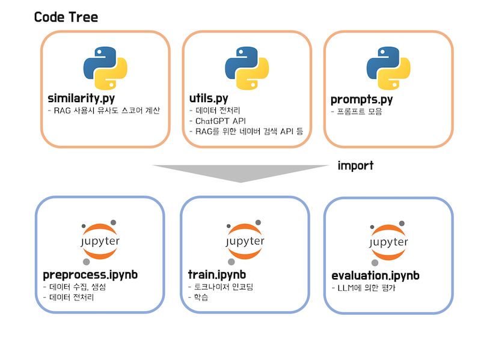

# 목적 
이 코드는 [Stanford Alpaca](https://github.com/tatsu-lab/stanford_alpaca)를 기반으로, 데이터 생성, 학습, 평가까지 밑바닥부터 Instruction Tuning을 실습해보는 코드입니다.  
참조 논문과 깃허브들은 링크가 걸려있으니, 되도록 원본 문서를 같이 보면서 학습해보면 큰 도움이 될 것 같습니다. 

# 목차
[개요](#개요)  
[예제 모델](#예제-모델)  
[코드 트리](#코드-트리)  
[훈련 스펙](#훈련-스펙)  
[Colab 가이드](#Colab-가이드)  
[참조](#참조)  

# 개요
이 예제 코드 크게 3가지로 구성되어 있습니다.  
1. OpenAI의 GPT API를 통해 [데이터를 생성](data/instruction.jsonl)합니다. 
2. 생성한 데이터로 [gemma-2b-it](https://huggingface.co/google/gemma-2b-it) 모델을 Fine-Tuning합니다.
3. 학습한 모델을 [LLM으로 평가](https://arxiv.org/pdf/2306.05685)합니다.

# 예제 모델
예제 모델은 [https://huggingface.co/aiqwe/gemma-2b-it-example-v1](https://huggingface.co/aiqwe/gemma-2b-it-example-v1)를 참조해주세요.

# 코드 트리
코드의 구성은 다음과 같습니다.  

+ `utils.py`, `similarity.py`, `prompts.py`를 커스텀 모듈로 `import`하여 사용합니다.
+ 데이터 생성과 학습, 평가는 주피터 노트북으로 실행합니다. 

[preprocess.ipynb](preprocess.ipynb)  
데이터를 전처리하는 과정을 담았습니다. 데이터 생성은 gpt-4-turbo와 gpt-4o API를 사용하였습니다.  
(데이터를 개선시키는 막바지에 gpt-4o가 출시되어 원가 절감에 큰 도움이 되었습니다 😆)  
`preprocess.ipynb` 코드는 **로컬**에서 실행할 수 있게 작성되었습니다.(Colab에서는 별도의 설정으로 사용해야합니다.)  

[train.ipynb](train.ipynb)  
`Dataset` 생성 등 데이터 준비과정과 LoRA학습등 Training코드가 담겨 있습니다.  
`train.ipynb` 코드는 **Google Colab**에서 실행될 수 있게 작성되었습니다.  

[evaluation.ipynb](evaluation.ipynb)  
LLM으로 부터 Evaluation을 받는 코드가 담겨 있습니다.
`evaluation.ipynb` 코드는 **Google Colab**에서 실행될 수 있게 작성되었습니다.  

# 훈련 스펙
학습은 쉽게 실험해 볼 수 있도록 [Google Colab](https://colab.google/)을 사용했으며, 예제 모델의 훈련시 스펙은 아래와 같습니다.

| 구분                          | 내용               |
|-----------------------------|------------------|
| 환경                          | Google Colab     |
| GPU                         | L4(22.5GB)       |
| 사용 VRAM                     | 약 13.8GB         |
| dtype                       | bfloat16         |
| Attention                   | flash attention2 |
| Tuning                      | Lora(r=4, alpha=32) |
| Learning Rate               | 1e-4             |
| LRScheduler                 | Cosine           |
| Optimizer                   | adamw_torch_fused |
| batch_size                  | 4                |
| gradient_accumulation_steps | 2                |

# Colab 가이드
Colab에서 실행하기위해 [colab_guide.md](colab_guide.md)를 참조해주세요.

# 참조
### 깃허브 및 가이드
+ [Stanford Alpaca](https://github.com/tatsu-lab/stanford_alpaca)
+ [chatgpt-prompt-engineering-for-developers](https://www.deeplearning.ai/short-courses/chatgpt-prompt-engineering-for-developers)
+ [awesome-chatgpt-prompts](https://github.com/f/awesome-chatgpt-prompts)
+ [openai-python](https://github.com/openai/openai-python)
+ [Fine-Tuning Gemma Models in Hugging Face](https://huggingface.co/blog/gemma-peft)
+ [google/gemma-2b-it](https://huggingface.co/google/gemma-2b-it)
+ [Flash Attention](https://github.com/Dao-AILab/flash-attention)
+ [네이버 API 가이드](https://developers.naver.com/docs/common/openapiguide/)
+ [transformers](https://github.com/huggingface/transformers/blob/main/src/transformers/models/gemma/modeling_gemma.py)
+ [wandb](https://kr.wandb.ai/)
+ [Generative AI with LLMs](https://www.deeplearning.ai/courses/generative-ai-with-llms/)
+ [입문자를 위한 병렬프로그래밍](https://product.kyobobook.co.kr/detail/S000001875036)

### 논문
+ [Gemma: Open Models Based on Gemini Research and Technology](https://arxiv.org/pdf/2403.08295)
+ [Self-Instruct: Aligning Language Models with Self-Generated Instructions](https://arxiv.org/pdf/2212.10560)
+ [Judging LLM-as-a-Judge with MT-Bench and Chatbot Arena](https://arxiv.org/pdf/2306.05685)
+ [LoRA: Low-Rank Adaptation of Large Language Models](https://arxiv.org/pdf/2106.09685)

