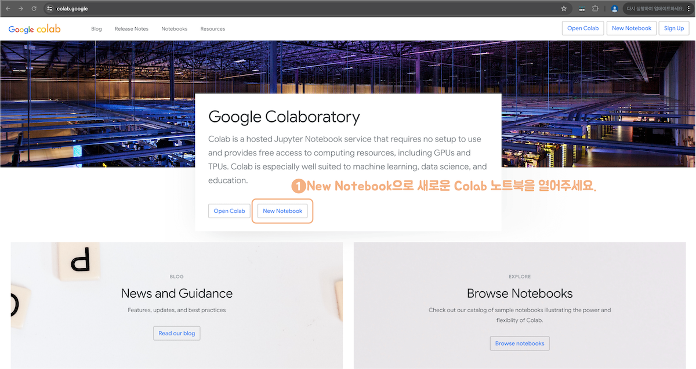
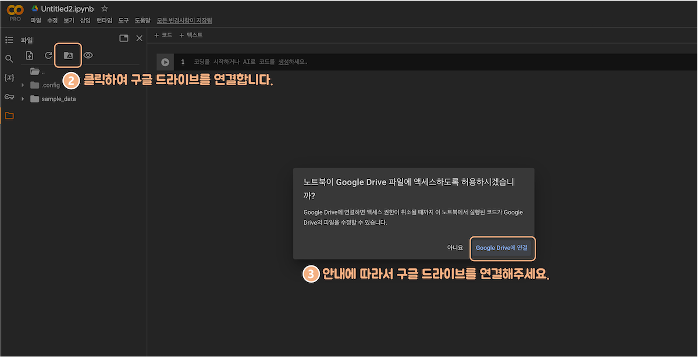
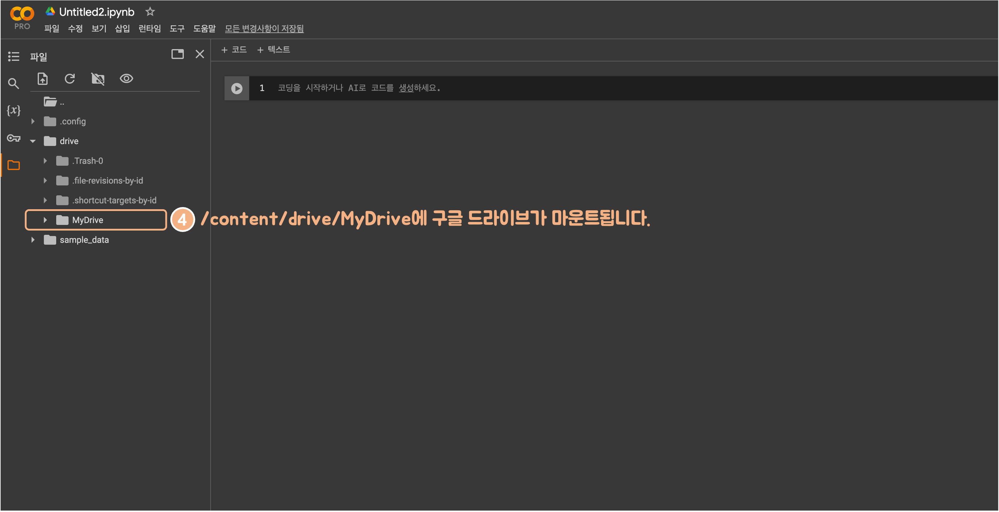
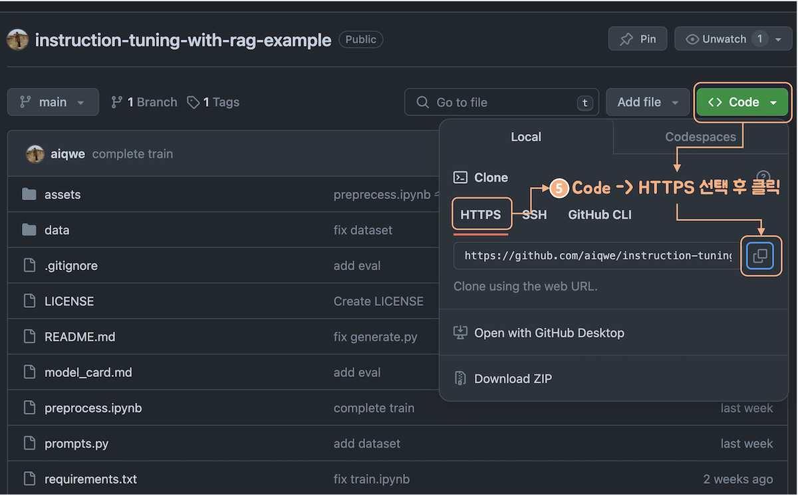
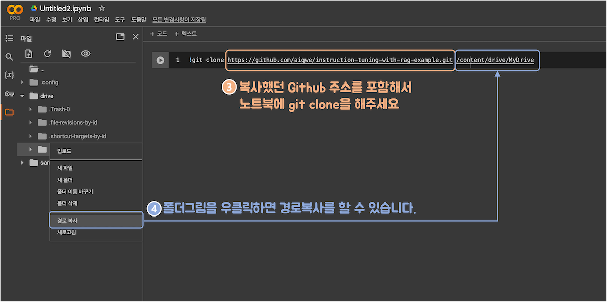
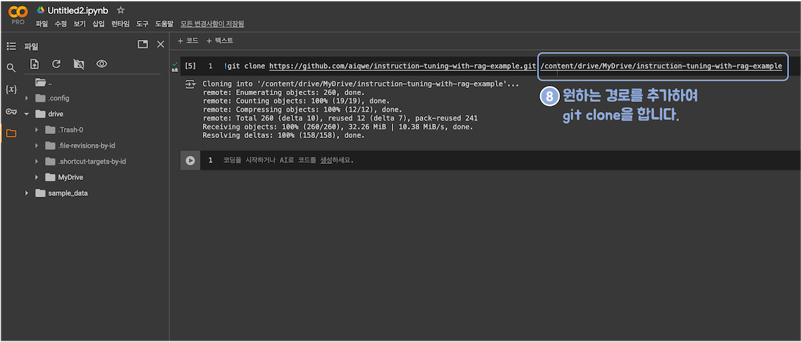
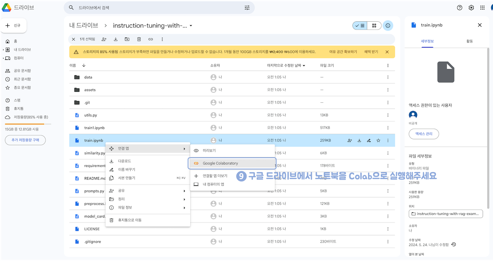
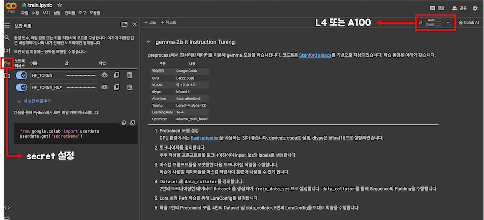
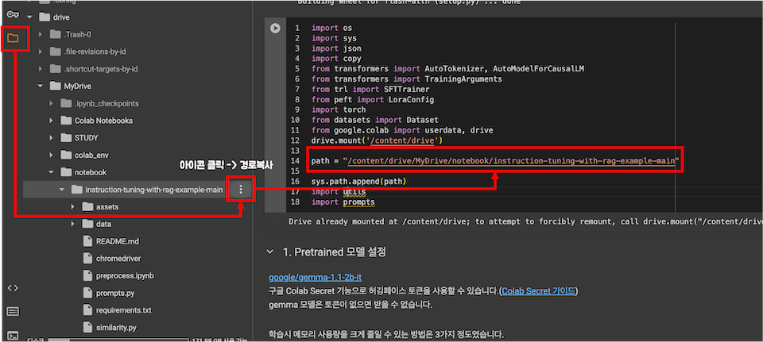

# Colab 실행 가이드
GPU 사용을 위해 Colab에서 실행해보겠습니다.  
아래 방법으로 손쉽게 소스코드들을 Colab에서 쉽게 열 수 있습니다.

---
### 1. google Colab에서 새 노트북 열기

Colab : [https://colab.google](https://colab.google//)  
Colab에서 새 노트를 작성합니다.  

### 2. Google Drive 연결하기
  
현재 Colab 노트북은 임시 파일입니다. 드라이브에 마운트하여 파일을 저장할 수 있도록 해보겠습니다.    
왼쪽 네비게이션 바에서 구글드라이브 연결 아이콘을 클릭하고 안내에 따라 연결합니다.    
  
구글 드라이브가 연결되면 왼쪽에 폴더들이 생겨납니다.  
구글 드라이브는 `/content/drive/MyDrive`로 연결됩니다.  

### 3. Github Clone  
  
[instuction-tuning-with-rag-example](https://github.com/aiqwe/instruction-tuning-with-rag-example.git) 레포지토리에서 주소를 복사합니다.
github의 https 주소를 복사합니다.  


노트북에서 `!git clone` 명령어와 함께 복사했던 github 주소와 함께 소스코드를 복사할 위치를 함께 입력합니다.  


아래와 같이 입력하면 구글드라이브에 `instruction-tuning-with-rage-example`이라는 폴더가 생기면서 소스코드가 해당 위치에 복사됩니다.
```
!git clone https://github.com/aiqwe/instruction-tuning-with-rag-example.git /content/drive/MyDrive
```

### 4. 소스코드 Colab 노트북에서 실행하기  

복사한 소스코드에서 `train.ipynb`을 우클릭하고 Google Colab에서 실행할 수 있습니다.

<br>
<br>
  
### etc. Colab에서 Secret, GPU 설정하기  
  
왼쪽 세로 네게이션 바를 보면 위 사진과 같이 열쇠 그림이 있습니다. 여기서 Secret을 설정할 수 있습니다.  
사진처럼 오른쪽 상단 빨간색 박스 안에는 사용하고 있는 GPU가 표시됩니다. 여기서 L4 또는 A100을 사용합니다.  
예제 코드는 `torch.bfloat16` 타입을 사용하기 때문에 Ampere 7 이전의 GPU에서는 지원되지 않습니다.  
+ Secret을 설정하는 방법은 [여기](https://medium.com/@parthdasawant/how-to-use-secrets-in-google-colab-450c38e3ec75)를 참조해 주세요.
+ `utils.py`의 함수들은 아래처럼 `.env` 파일을 만들면 자동으로 환경변수를 읽습니다.(또는 시스템 환경변수를 읽습니다.)
```bash
# .env 파일
OPENAI_API_KEY=발급받은KEY
```
+ `train.ipynb` 파일의 huggingface토큰은 함수 인자에 직접 입력하거나 Colab Secret을 활용해주세요.(Colab을 가정하기 때문에 환경변수로 읽지 않습니다.)

<br>
<br>

5. `import`를 위한 `path` 지정하기  
  
다시 왼쪽 세로 네게이션 바를 보면 위 사진과 같이 폴더 그림이 있습니다. 여기서 연결된 구글 드라이브로 탐색할 수 있습니다.  
`drive.mount('/content/drive')` 코드로 구글 드라이브를 연결하면 위 사진처럼 드라이브의 폴더들이 보입니다.  
`utils.py`, `prompts.py`, `similarity.py` 모듈을 `import`하기 위해 위 사진처럼 `sys.path`에 추가합니다.

<br>
<br>

+ `train.ipynb` 에서 huggingface 토큰을 지정해야합니다.  
Gemma 모델을 로드하기 위해서는 huggingface의 gemma 모델 사용 신청을 하고, huggingface 토큰을 발급받아야 합니다.  
토큰 발급은 huggingface의 [User Access Tokens](https://huggingface.co/docs/hub/security-tokens)를 참조하세요.  